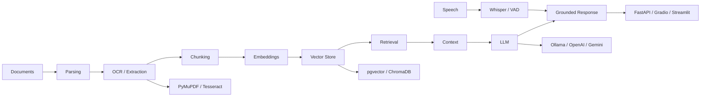

# 👋 Hi, I'm Fizza Hussain

### Data Science · AI/ML · Software & Data Projects

  

 

I'm a **third-year BS Data Science student at FAST-NUCES Islamabad**. I enjoy figuring out how things work and then trying to build them myself, from algorithms and data projects to web applications and AI-powered tools.

I'm particularly interested in **AI/ML, Data Science, NLP, LLM applications, RAG, recommendation systems, and intelligent applications**, while continuing to strengthen my software engineering and systems fundamentals.

 

  

`AI / Data` · `Software` · `Full-Stack` · `Algorithms`

---

# 🧠 What I'm Interested In

<table>
<tr>
<td width="34%" valign="top">

## 🤖 AI & Data

Machine learning, NLP, LLM applications, retrieval, recommendation systems, data analysis, and experimenting with AI tools while building.

</td>
<td width="33%" valign="top">

## 💻 Building

Python and C++ projects, backend APIs, databases, web applications, game AI, and data-driven applications.

</td>
<td width="33%" valign="top">

## ⚙️ Foundations

Data structures, operating systems, concurrency, databases, graphics, and low-level programming.

</td>
</tr>
</table>

---

# ⭐ Flagship Work

A few projects that best represent what I've been interested in building and learning.

<table>
<tr>
<td width="50%" valign="top">

## 🧠 RAG Document Assistant
**Local-first document intelligence**

A document assistant combining multi-format ingestion, selective OCR, speech-to-text, semantic retrieval, vector search, local LLMs, grounded citations, conversation memory, authentication, and containerized services.

**Built with:** Python · FastAPI · PostgreSQL · pgvector · Ollama · Gradio · Docker

[**Explore →**](https://github.com/fizzahussain/Rag-Document-Assistant)

</td>
<td width="50%" valign="top">

## 🔬 Revival Lab
**Retrieval-focused research project**

A project exploring semantic retrieval over a curated archive of historical ideas and solutions, using retrieval to investigate how older ideas can be adapted to modern constraints.

**Built with:** Python · ChromaDB · LangChain · OpenAI · Gradio

[**Explore →**](https://github.com/fizzahussain/Revival-Lab)

</td>
</tr>

<tr>
<td width="50%" valign="top">

## 🎮 UNO: 3 Player AI vs Human
**Game AI & decision making**

A game AI project using Minimax, alpha-beta pruning, Expectimax, chance nodes, game-state evaluation, and search-depth trade-offs. It also became a good debugging exercise while working through turn handling, AI search, timeouts, and the playable interface.

**Built with:** Python · Minimax · Expectimax · JavaScript

[**Explore →**](https://github.com/fizzahussain/UNO-3Player-AIvsHuman)

</td>
<td width="50%" valign="top">

## 🎬 MoviesData Manager
**Algorithms + recommendation**

A C++ movie data project using AVL trees, hash tables, graph relationships, BFS, filtering, and recommendation logic.

**Built with:** C++ · AVL Trees · Hash Tables · Graphs · BFS

[**Explore →**](https://github.com/fizzahussain/MoviesData-MANAGER)

</td>
</tr>
</table>

---

# 🧩 AI Systems Blueprint

The parts of an AI application I've been most interested in learning by actually putting them together:

**What I've worked with inside this:**

`PyMuPDF` · `Tesseract OCR` · `faster-whisper` · `VAD` · `pgvector` · `ChromaDB` · `HNSW` · `cosine search` · `Ollama` · `OpenAI` · `Gemini` · `FastAPI` · `Gradio` · `Streamlit` · `Docker`

The goal isn't just using an LLM. I've been interested in understanding what happens around it: how documents become searchable, how relevant context is selected, how citations are grounded, and how the pieces fit into an actual application.

---

# 🧰 My Toolbox

## 🤖 AI / Data

## 💻 Development

## 🗄️ Databases & Tools

---

# 🔎 Explore More

<b>Systems & Data</b>

### ⚙️ Systems & Concurrency

Processes, `fork()` / `execvp()`, pthreads, FIFO communication, producer-consumer queues, semaphores, shared memory, signals, and parallel data processing.

[**Parallel CSV Data Processing Pipeline →**](https://github.com/fizzahussain/Parallel-CSV-Data-Processing-Pipeline)

### 🗄️ Databases & Backend

RideFlow, SQL views, procedures, triggers, indexes, APIs, SQLite, MySQL, and PostgreSQL across coursework and personal projects.

[**RideFlow →**](https://github.com/fizzahussain/RideFlow) · [**Personal Finance Management System →**](https://github.com/fizzahussain/Personal-Finance-Management-System)

<b>Graphics & Low-Level Work</b>

### 🎮 Games & Graphics

C++ projects using OpenGL, SDL2, OOP, game loops, graph traversal, collision handling, state management, and persistence.

[**Rush Hour →**](https://github.com/fizzahussain/RushHour-game) · [**Word Shooter →**](https://github.com/fizzahussain/Wordshooter-game)

### ⚙️ Low-Level Programming

An x86 Assembly version of Rush Hour using MASM/Irvine32, with registers, procedures, memory operations, file I/O, and system-level APIs.

[**Rush Hour Assembly →**](https://github.com/fizzahussain/RUSHHOUR_Assembly)

<b>Data & Analytics</b>

Exploratory analysis, visualization, financial reporting, dashboards, SQL, clickstream aggregation, and data-processing workflows across different projects.

[**Explore all repositories →**](https://github.com/fizzahussain?tab=repositories) · [**Explore the portfolio →**](https://fizza-hussain.vercel.app/)

Some projects are **university coursework, some are personal projects, and some are things I've continued improving after the course ended**. I keep them because the progression is part of the story.

---

# 📈 GitHub Activity

  

---

# 🎯 What I'm Exploring Next

I'm currently going deeper into **Machine Learning, NLP, retrieval, recommendation systems, data engineering, and backend development**.

I'm also interested in exploring areas outside the usual Data Science path when something catches my attention. I like learning by building and seeing where that takes me.

---

# 🤝 Let's Connect

I'm always interested in learning, building, collaborating, and exploring ideas across different areas of technology.

  

**Still learning · still experimenting · still building**

