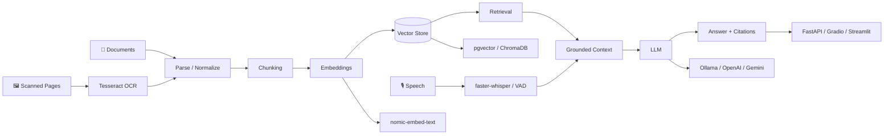

# 👋 Hi, I'm Fizza Hussain

### Data Science · AI/ML · Software Development

  

 

I'm a **third-year BS Data Science student at FAST-NUCES Islamabad**. I enjoy figuring out how things work and then trying to build them myself, from algorithms and data projects to web applications and AI-powered tools.

I'm especially interested in **AI/ML, Data Science, NLP, RAG, recommendation systems, and intelligent applications**, while continuing to build my software engineering and systems fundamentals.

 

---

# 🌟 Flagship Work

A few projects that best represent what I've been building and learning recently.

<table>
<tr>
<td width="50%" valign="top">

## 🧠 RAG Document Assistant

**Local-first document intelligence**

My strongest AI systems project. It brings together multi-format document ingestion, selective OCR, speech-to-text, retrieval, local generation, citations, conversation memory, authentication, evaluation, and Dockerized services.

**AI layer**  
`Ollama` · `llama3.2` · `nomic-embed-text` · `RAG`

**Retrieval**  
`PostgreSQL` · `pgvector` · `HNSW` · `cosine search`

**Document & speech**  
`PyMuPDF` · `Tesseract OCR` · `faster-whisper` · `VAD`

**Application**  
`FastAPI` · `Gradio` · `SQLAlchemy` · `Alembic` · `Docker`

[**Explore RAG Document Assistant →**](https://github.com/fizzahussain/Rag-Document-Assistant)

</td>
<td width="50%" valign="top">

## 🔬 Revival Lab

**Forensic RAG research**

A research-oriented RAG project that retrieves forgotten solutions from a curated knowledge archive and explores how historical ideas could be adapted to modern constraints.

**What I explored**  
`ChromaDB` · `LangChain` · `OpenAI` · `Gradio` · semantic retrieval · curated evidence · local fallback retrieval

It pushed me beyond simply asking questions over documents and into thinking about retrieval as a way to navigate evidence.

[**Explore Revival Lab →**](https://github.com/fizzahussain/Revival-Lab)

</td>
</tr>

<tr>
<td width="50%" valign="top">

## 🍽️ MoodMeal

**AI inside a real product**

A full-stack meal planning application with pantry tracking, recipe recommendations, food-expense analytics, expiry awareness, saved recipes, and a Gemini-powered cooking assistant.

`React` · `Node.js` · `Express` · `MySQL` · `Gemini API`

[**Explore MoodMeal →**](https://github.com/fizzahussain/MoodMeal)

</td>
<td width="50%" valign="top">

## 🎬 MoviesData Manager

**Algorithms + recommendation**

A C++ movie data system built around AVL trees, hash tables, graph relationships, BFS, filtering, and custom recommendation logic.

`C++` · `AVL Trees` · `Hash Tables` · `Graphs` · `BFS`

[**Explore MoviesData Manager →**](https://github.com/fizzahussain/MoviesData-MANAGER)

</td>
</tr>
</table>

---

# 🧩 AI Systems Blueprint

The graph below shows the parts of an AI application I've actually worked with and wanted to understand beyond just calling a model API.

<b>🔍 What I care about inside the system</b>

 

- **Ingestion:** different formats, parsing, metadata, malformed content
- **OCR:** having a fallback when normal text extraction fails
- **Speech:** faster-whisper and VAD as another way to interact with the system
- **Chunking:** deciding what context should actually be retrieved
- **Embeddings:** how documents and queries are represented
- **Retrieval:** top-k search, cosine similarity, HNSW, relevance
- **Grounding:** giving the model useful retrieved context instead of just prompting it
- **Citations:** making the source of an answer inspectable
- **Evaluation:** checking retrieval and outputs rather than judging only by how fluent they sound
- **Application:** APIs, authentication, migrations, interfaces, Docker, and the rest of the software around the model

---

# 🧰 My Toolbox

## 🤖 AI / Data

## 💻 Development

## 🗄️ Databases & Tools

---

# 🔎 Explore More

<b>Systems & Data</b>

 

**Systems & concurrency**  
Processes, `fork()` / `execvp()`, pthreads, FIFO communication, producer-consumer queues, semaphores, shared memory, signals, and parallel data processing.

[**Parallel CSV Data Processing Pipeline →**](https://github.com/fizzahussain/Parallel-CSV-Data-Processing-Pipeline)

**Databases & backend**  
RideFlow, SQL views, procedures, triggers, indexes, APIs, SQLite, MySQL, and PostgreSQL.

[**RideFlow →**](https://github.com/fizzahussain/RideFlow) · [**Personal Finance Management System →**](https://github.com/fizzahussain/Personal-Finance-Management-System)

<b>Graphics & Low-Level</b>

 

**Games & graphics**  
C++ projects using OpenGL, SDL2, OOP, game loops, graph traversal, collision handling, and state management.

[**Rush Hour →**](https://github.com/fizzahussain/RushHour-game) · [**Word Shooter →**](https://github.com/fizzahussain/Wordshooter-game)

**Low-level work**  
An x86 Assembly version of Rush Hour using MASM/Irvine32, including registers, procedures, memory operations, file I/O, and system APIs.

[**Rush Hour Assembly →**](https://github.com/fizzahussain/RUSHHOUR_Assembly)

<b>Data & Analytics</b>

 

Exploratory analysis, visualization, financial reporting, dashboards, SQL, clickstream aggregation, and data-processing workflows across different projects.

[**Explore all repositories →**](https://github.com/fizzahussain?tab=repositories) · [**Explore the portfolio →**](https://fizza-hussain.vercel.app/)

Some projects are **university coursework, some are personal projects, and some are things I've continued improving after coursework**. I like keeping that progression visible.

---

# 📈 GitHub Activity

  

---

# 🎯 What I'm Exploring Next

I'm currently going deeper into **Machine Learning, NLP, retrieval, recommendation systems, data engineering, and backend development**.

I'm also interested in exploring areas outside the usual Data Science path when something catches my attention. I like learning by building and seeing where that takes me.

---

# 🤝 Let's Connect

I'm always interested in learning, building, collaborating, and exploring ideas across different areas of technology.

  

**Still learning · still experimenting · still building**

