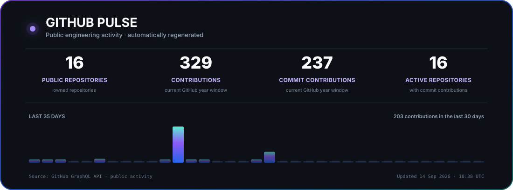

# 👋 Hi, I'm Fizza Hussain

### BS Data Science · FAST-NUCES Islamabad

 

---

I'm a **third-year BS Data Science student at FAST-NUCES Islamabad**. I like figuring out how things work and then trying to build them myself, from algorithms and data projects to web applications and AI-powered tools.

I'm especially interested in **AI/ML, Data Science, NLP, and applications around models and data**, while continuing to build my software engineering and systems fundamentals.

---

# 🌟 A Few Projects

These are some of the projects that best represent what I've been building and learning recently.

<table>
<tr>
<td width="50%" valign="top">

## 🧠 RAG Document Assistant

**Local-first document intelligence**

A document assistant that works with different document formats, uses OCR when needed, accepts voice queries, retrieves relevant context, and generates answers with citations. I've also explored authentication, evaluation, conversation memory, and containerized services around it.

`RAG` · `Ollama` · `pgvector` · `Tesseract OCR` · `faster-whisper` · `FastAPI` · `Docker`

[**Explore →**](https://github.com/fizzahussain/Rag-Document-Assistant)

</td>
<td width="50%" valign="top">

## 🔬 Revival Lab

**Research-oriented RAG**

A project that retrieves forgotten solutions from a curated knowledge archive and explores how older ideas could be adapted to modern constraints.

`ChromaDB` · `LangChain` · `OpenAI` · `Gradio` · semantic retrieval

[**Explore →**](https://github.com/fizzahussain/Revival-Lab)

</td>
</tr>

<tr>
<td width="50%" valign="top">

## 🍽️ MoodMeal

**Full-stack meal planning**

A meal planning application with pantry tracking, recipe recommendations, food-expense analytics, expiry awareness, saved recipes, and a Gemini-powered cooking assistant.

`React` · `Node.js` · `Express` · `MySQL` · `Gemini API`

[**Explore →**](https://github.com/fizzahussain/MoodMeal)

</td>
<td width="50%" valign="top">

## 🎬 MoviesData Manager

**Algorithms + recommendation**

A C++ movie data system built around AVL trees, hash tables, graph relationships, BFS, filtering, and custom recommendation logic.

`C++` · `AVL Trees` · `Hash Tables` · `Graphs` · `BFS`

[**Explore →**](https://github.com/fizzahussain/MoviesData-MANAGER)

</td>
</tr>
</table>

---

# 🧰 Tools I Use

## 🤖 AI / Data

## 💻 Languages

## 🌐 Web / APIs

## 🗄️ Databases

## ⚙️ Systems / Graphics

## 🛠️ Development

---

# 📂 More Things I've Built

- **UNO — 3 Player AI vs Human** — Minimax, alpha-beta pruning, Expectimax, chance nodes and game-tree comparisons. [Explore →](https://github.com/fizzahussain/UNO-3Player-AIvsHuman)
- **RideFlow** — database-driven ride-hailing system with SQL views, stored procedures, triggers, wallets, payments and analytics. [Explore →](https://github.com/fizzahussain/RideFlow)
- **Personal Finance Management System** — FastAPI + Streamlit application for transactions, budgets, reports and analytics. [Explore →](https://github.com/fizzahussain/Personal-Finance-Management-System)
- **Rush Hour** — C++ game using OpenGL/SDL2, with a separate x86 Assembly version. [Explore →](https://github.com/fizzahussain/RushHour-game)
- **Parallel CSV Data Processing Pipeline** — processes, pthreads, queues, semaphores and shared memory. [Explore →](https://github.com/fizzahussain/Parallel-CSV-Data-Processing-Pipeline)

[**See all repositories →**](https://github.com/fizzahussain?tab=repositories)

---

# 📊 GitHub Pulse

  

---

# 🌱 What I'm Exploring

I'm currently going deeper into **machine learning, NLP, retrieval, recommendation systems, data engineering, and backend development**.

I'm also curious about areas outside the usual Data Science path. If something catches my attention, I like learning about it by building something and seeing where it leads.

---

[**Portfolio**](https://fizza-hussain.vercel.app/) · [**LinkedIn**](https://www.linkedin.com/in/fizza-hussain-97a171279/) · [**GitHub**](https://github.com/fizzahussain)

 

*Still learning · still experimenting · still building*

