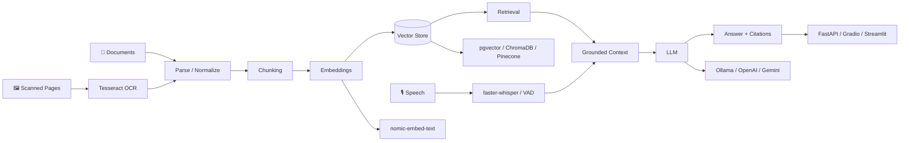

# 👋 Hi, I'm Fizza Hussain

### BS Data Science · FAST-NUCES Islamabad

  

 

I'm a **third-year BS Data Science student at FAST-NUCES Islamabad**. I like figuring out how things work and then trying to build them myself, from algorithms and data projects to web applications and AI-powered tools.

I'm especially interested in **AI/ML, Data Science, NLP, and building applications around models and data**, while continuing to strengthen my software engineering and systems fundamentals.

 

---

# 🌟 Flagship Work

A few projects that best represent what I've been building and learning recently.

<table>
<tr>
<td width="50%" valign="top">

## 🧠 RAG Document Assistant

**Local-first document intelligence**

A document assistant bringing together multi-format ingestion, selective OCR, speech-to-text, retrieval, local generation, citations, conversation memory, authentication, evaluation, and Dockerized services.

**AI layer**  
`Ollama` · `llama3.2` · `nomic-embed-text` · `RAG`

**Retrieval**  
`PostgreSQL` · `pgvector` · `HNSW` · `cosine search`

**Document & speech**  
`PyMuPDF` · `Tesseract OCR` · `faster-whisper` · `VAD`

**Application**  
`FastAPI` · `Gradio` · `SQLAlchemy` · `Alembic` · `Docker`

[**Explore RAG Document Assistant →**](https://github.com/fizzahussain/Rag-Document-Assistant)

</td>
<td width="50%" valign="top">

## 🔬 Revival Lab

**Research-oriented RAG**

A project that retrieves forgotten solutions from a curated knowledge archive and explores how historical ideas could be adapted to modern constraints.

**What I explored**  
`ChromaDB` · `LangChain` · `OpenAI` · `Gradio` · semantic retrieval · curated evidence · local fallback retrieval

It got me thinking about retrieval as a way to navigate evidence, rather than simply asking questions over documents.

[**Explore Revival Lab →**](https://github.com/fizzahussain/Revival-Lab)

</td>
</tr>

<tr>
<td width="50%" valign="top">

## 🍽️ MoodMeal

**Full-stack meal planning**

A meal planning application with pantry tracking, recipe recommendations, food-expense analytics, expiry awareness, saved recipes, and a Gemini-powered cooking assistant.

`React` · `Node.js` · `Express` · `MySQL` · `Gemini API`

[**Explore MoodMeal →**](https://github.com/fizzahussain/MoodMeal)

</td>
<td width="50%" valign="top">

## 🎬 MoviesData Manager

**Algorithms + recommendation**

A C++ movie data system built around AVL trees, hash tables, graph relationships, BFS, filtering, and custom recommendation logic.

`C++` · `AVL Trees` · `Hash Tables` · `Graphs` · `BFS`

[**Explore MoviesData Manager →**](https://github.com/fizzahussain/MoviesData-MANAGER)

</td>
</tr>
</table>

---

# 🧩 AI Systems Blueprint

The graph below shows the parts of an AI application I've worked with and wanted to understand beyond just calling a model API.

<b>🔍 What I care about inside the system</b>

 

- **Ingestion:** different formats, parsing, metadata, malformed content
- **OCR:** having a fallback when normal text extraction fails
- **Speech:** faster-whisper and VAD as another way to interact with the system
- **Chunking:** deciding what context should actually be retrieved
- **Embeddings:** how documents and queries are represented
- **Retrieval:** top-k search, cosine similarity, HNSW, relevance
- **Grounding:** giving the model useful retrieved context instead of just prompting it
- **Citations:** making the source of an answer inspectable
- **Evaluation:** checking retrieval and outputs rather than judging only by how fluent they sound
- **Application:** APIs, authentication, migrations, interfaces, Docker, and the software around the model

---

# 🧰 My Toolbox

**AI / Data**  
`Python` · `RAG` · `Ollama` · `llama3.2` · `nomic-embed-text` · `OpenAI` · `Gemini` · `LangChain` · `ChromaDB` · `Pinecone` · `pgvector` · `HNSW` · `Tesseract OCR` · `PyMuPDF` · `faster-whisper` · `VAD` · `NumPy` · `Pandas` · `Matplotlib` · `Power BI`

**Languages**  
`Python` · `C++` · `C` · `JavaScript` · `HTML` · `CSS` · `SQL` · `x86 Assembly` · `Bash`

**Web / APIs**  
`React` · `Node.js` · `Express` · `FastAPI` · `Bootstrap` · `Gradio` · `Streamlit` · `EJS` · `REST APIs` · `JWT`

**Databases / Persistence**  
`PostgreSQL` · `MySQL` · `SQLite` · `SQLAlchemy` · `Alembic` · `Views` · `Triggers` · `Stored Procedures` · `Vector Search`

**Systems / Graphics**  
`POSIX IPC` · `pthreads` · `Queues` · `Semaphores` · `Shared Memory` · `OpenGL` · `SDL2` · `MASM / Irvine32`

**Tools**  
`Docker` · `Docker Compose` · `Git` · `GitHub Actions` · `Linux` · `VS Code` · `pytest` · `Figma` · `Canva`

---

# 🧪 Explore the Portfolio by Signal

<b>🤖 I want to see AI / Data work</b>

 

1. [**RAG Document Assistant**](https://github.com/fizzahussain/Rag-Document-Assistant) — RAG, Ollama, OCR, STT, pgvector, HNSW, Docker
2. [**Revival Lab**](https://github.com/fizzahussain/Revival-Lab) — research-oriented RAG, ChromaDB, LangChain
3. [**UNO: 3 Player AI vs Human**](https://github.com/fizzahussain/UNO-3Player-AIvsHuman) — Minimax vs Expectimax
4. [**MoviesData Manager**](https://github.com/fizzahussain/MoviesData-MANAGER) — recommendation, graphs, BFS
5. [**MoodMeal**](https://github.com/fizzahussain/MoodMeal) — Gemini-powered meal planning
6. [**Personal Finance Management System**](https://github.com/fizzahussain/Personal-Finance-Management-System) — transaction analytics and data management

<b>🌐 I want to see full-stack / database work</b>

 

1. [**MoodMeal**](https://github.com/fizzahussain/MoodMeal) — React, Node, Express, MySQL, Gemini
2. [**RideFlow**](https://github.com/fizzahussain/RideFlow) — Express, EJS, MySQL, views, procedures, triggers
3. [**Personal Finance Management System**](https://github.com/fizzahussain/Personal-Finance-Management-System) — FastAPI, Streamlit, SQLite
4. [**CamCorder Website**](https://github.com/fizzahussain/CamCorder_website) — multi-page e-commerce UI

<b>🧠 I want to see algorithms / DSA</b>

 

1. [**MoviesData Manager**](https://github.com/fizzahussain/MoviesData-MANAGER) — AVL trees, hash tables, graphs, BFS
2. [**UNO: 3 Player AI vs Human**](https://github.com/fizzahussain/UNO-3Player-AIvsHuman) — game-tree search
3. [**Rush Hour**](https://github.com/fizzahussain/RushHour-game) — DFS reachability, OOP state
4. [**Word Shooter**](https://github.com/fizzahussain/Wordshooter-game) — binary-search dictionary lookup

<b>⚙️ I want to see systems / low-level work</b>

 

1. [**Parallel CSV Data Processing Pipeline**](https://github.com/fizzahussain/Parallel-CSV-Data-Processing-Pipeline) — processes, pthreads, queues, semaphores, shared memory
2. [**Rush Hour Assembly**](https://github.com/fizzahussain/RUSHHOUR_Assembly) — x86 Assembly, MASM/Irvine32, memory and file I/O
3. [**Rush Hour**](https://github.com/fizzahussain/RushHour-game) — C++, OpenGL, SDL2, game state
4. [**Word Shooter**](https://github.com/fizzahussain/Wordshooter-game) — C++, SDL2, OOP, game loop

<b>📊 I want to see data / analytics work</b>

 

1. [**Personal Finance Management System**](https://github.com/fizzahussain/Personal-Finance-Management-System) — transaction analytics, budgets, dashboards
2. [**RideFlow**](https://github.com/fizzahussain/RideFlow) — SQL analytics, views, procedures, reporting
3. [**MoviesData Manager**](https://github.com/fizzahussain/MoviesData-MANAGER) — structured data, filtering, recommendations

 

[**Explore all repositories →**](https://github.com/fizzahussain?tab=repositories) · [**Explore the portfolio →**](https://fizza-hussain.vercel.app/)

Some projects are **university coursework, some are personal projects, and some are things I've continued improving after coursework**. I like keeping that progression visible.

---

# 📊 GitHub Pulse

### Live GitHub activity

  

### Contribution Activity

  

### Contributions but make it my fav childhood game

---

# 🎯 What I'm Exploring Next

I'm currently going deeper into **machine learning, NLP, retrieval, recommendation systems, data engineering, and backend development**.

I'm also curious about areas outside the usual Data Science path. If something catches my attention, I like learning about it by building something and seeing where it leads.

---

# 🤝 Let's Connect

I'm always interested in learning, building, collaborating, and exploring ideas across different areas of technology.

  

**Still learning · still experimenting · still building**

