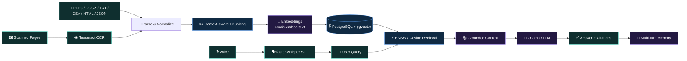

# 👋 Hi, I'm Fizza Hussain

### AI & Data Systems · Software Engineering · Full-Stack Development

  

 

**I don't just connect an API to a UI. I like understanding the whole path from raw data to retrieval, reasoning, storage, APIs, product flows, concurrency, and the machine-level foundations underneath.**

 

  

`AI / Data` · `RAG` · `LLM Applications` · `Software Engineering` · `Full-Stack` · `Algorithms` · `Systems`

---

# ⚡ My Engineering Signature

<table>
<tr>
<td width="34%" valign="top">

## 🧠 AI-first

I am building toward **AI & Data Science** through systems that actually retrieve, reason, evaluate, recommend, analyze, and interact with real data.

**RAG · LLMs · OCR · STT · embeddings · vector search · recommendation · search AI · analytics**

</td>
<td width="33%" valign="top">

## 🏗️ End-to-end

I like owning the path beyond the model.

**UI → API → auth → data model → retrieval → database → testing → Docker → deployment**

</td>
<td width="33%" valign="top">

## ⚙️ Foundations matter

My portfolio also goes beneath web frameworks.

**AVL trees · graphs · BFS/DFS · Minimax · pthreads · IPC · shared memory · x86 Assembly**

</td>
</tr>
</table>

> ### The differentiator
> **My goal is to become the engineer who can build the intelligent feature _and_ understand the software system carrying it.**

---

# 🧬 AI Systems Blueprint

This is the kind of pipeline I have already worked across in my RAG/document-intelligence projects:

<b>🔍 What I care about inside an AI system</b>

 

- **Ingestion quality** — different formats, malformed content, duplicates, metadata
- **OCR fallback** — text extraction should not silently fail on scanned documents
- **Speech input** — voice becomes another query interface, not a separate toy feature
- **Chunking strategy** — context boundaries and overlap directly affect retrieval
- **Embeddings** — the representation layer matters
- **Vector storage** — persistence, indexes, user isolation, filtering
- **Retrieval** — cosine similarity, HNSW, top-k, thresholds, relevance
- **Grounding** — the model should answer from retrieved evidence
- **Citations** — users should be able to inspect where an answer came from
- **Evaluation** — retrieval quality matters independently of fluent generation
- **Product engineering** — auth, APIs, streaming, migrations, Docker, logging, tests

---

# 🌟 Flagship Work

<table>
<tr>
<td width="50%" valign="top">

## 🧠 RAG Document Assistant
**Local-first document intelligence**

My strongest AI systems project: multi-format ingestion, selective OCR, speech-to-text, semantic retrieval, local generation, grounded citations, conversation memory, authentication, evaluation, and containerized services.

**AI layer**  
`Ollama` · `llama3.2` · `nomic-embed-text` · `RAG`

**Retrieval layer**  
`PostgreSQL` · `pgvector` · `HNSW` · `cosine search`

**Multimodal layer**  
`PyMuPDF` · `Tesseract OCR` · `faster-whisper` · `VAD`

**Engineering layer**  
`FastAPI` · `Gradio` · `SQLAlchemy` · `Alembic` · `Docker`

[**Explore RAG Document Assistant →**](https://github.com/fizzahussain/Rag-Document-Assistant)

</td>
<td width="50%" valign="top">

## 🔬 Revival Lab
**Forensic RAG research**

A research-oriented RAG system that retrieves forgotten solutions from a curated knowledge archive and helps investigate how historical ideas could be adapted to modern constraints.

**What I explored**

`ChromaDB` · `LangChain` · `OpenAI` · `Gradio` · semantic retrieval · curated evidence · local fallback retrieval

**Why it matters**

It pushed me beyond “ask questions over documents” toward retrieval as a **research and evidence-navigation problem**.

[**Explore Revival Lab →**](https://github.com/fizzahussain/Revival-Lab)

</td>
</tr>
<tr>
<td width="50%" valign="top">

## 🍽️ MoodMeal
**AI inside a real product**

Full-stack smart meal planning with pantry tracking, personalized recipe recommendations, food-expense analytics, expiry awareness, saved recipes, and a Gemini-powered cooking assistant.

`React` · `Node.js` · `Express` · `MySQL` · `Gemini API`

[**Explore MoodMeal →**](https://github.com/fizzahussain/MoodMeal)

</td>
<td width="50%" valign="top">

## 🎬 MoviesData Manager
**Algorithms + recommendation**

C++ movie data system built around AVL trees, hash tables, graph relationships, BFS, filtering, and custom recommendation logic.

`C++` · `AVL Trees` · `Hash Tables` · `Graphs` · `BFS`

[**Explore MoviesData Manager →**](https://github.com/fizzahussain/MoviesData-MANAGER)

</td>
</tr>
</table>

---

# 🧠 AI + Data Lab

| Area | What I've actually built / explored |
|---|---|
| **RAG & LLM systems** | local-first RAG, grounded generation, citations, multi-turn context, Ollama, LangChain |
| **Vector retrieval** | embeddings, pgvector, ChromaDB, cosine search, HNSW indexing, top-k retrieval |
| **Document intelligence** | PDF/DOCX/TXT/Markdown/CSV/HTML/JSON ingestion, PyMuPDF, OCR fallback |
| **Speech AI** | faster-whisper, VAD, CPU/int8 inference, persistent model cache |
| **Search AI** | Minimax, alpha-beta pruning, Expectimax, chance nodes |
| **Recommendations** | movie recommendation logic, pantry/recipe matching |
| **Data analytics** | personal finance analytics, expense analysis, budgets, reports, clickstream aggregation |
| **Evaluation mindset** | retrieval quality, explicit test/evaluation scripts, edge cases, grounded outputs |

<b>🎮 Open the Search AI project</b>

 

### UNO — 3 Player AI vs Human

A Python/Jupyter simulation comparing defensive **Minimax**, **alpha-beta pruning**, probabilistic **Expectimax**, explicit draw probabilities/chance nodes, human-vs-AI play, automated comparisons, and search-tree visualization.

[**Explore UNO AI →**](https://github.com/fizzahussain/UNO-3Player-AIvsHuman)

<b>📊 Open the Analytics project</b>

 

### Personal Finance Management System

A full-stack personal-finance analytics platform with FastAPI, Streamlit, SQLite, secure multi-user accounts, transaction tracking, category budgets, reporting, exports, caching, and flexible storage layers.

[**Explore Personal Finance →**](https://github.com/fizzahussain/Personal-Finance-Management-System)

---

# 🧰 My Toolbox

## 🤖 AI / ML / Data Intelligence

## 💻 Languages

## 🌐 Product / Frontend / API

## 🗄️ Data / Persistence

## ⚙️ Systems / Low-Level

## 🧪 Engineering / Tooling

---

# 🧩 Systems & Database Engineering

<table>
<tr>
<td width="50%" valign="top">

## ⚡ Parallel CSV Data Processing Pipeline

Concurrent C++ clickstream analytics using multiple processes, `fork()` / `execvp()`, FIFO communication, pthread worker pools, bounded producer-consumer queues, semaphores, mutexes, POSIX shared memory, signals, lifecycle management, and TXT/CSV reporting.

[**Explore systems pipeline →**](https://github.com/fizzahussain/Parallel-CSV-Data-Processing-Pipeline)

</td>
<td width="50%" valign="top">

## 🚕 RideFlow

Database-driven ride-hailing system with Rider/Driver/Admin workflows, verification, wallets/payments, earnings/commissions, complaints/ratings, analytics, SQL views, stored procedures, triggers, indexes, and scheduled events.

[**Explore RideFlow →**](https://github.com/fizzahussain/RideFlow)

</td>
</tr>
</table>

---

# 🎮 Graphics, OOP & Low-Level Work

<b>🚕 Rush Hour — C++ / OpenGL / OOP</b>

 

A graphical driving game with Taxi and Delivery roles, dynamic traffic, fuel management, task-based scoring, DFS reachability, role switching, difficulty progression, and a persistent leaderboard.

**Signal:** OOP design, stateful gameplay systems, graph traversal, graphics/event loops, persistence.

[**View repository →**](https://github.com/fizzahussain/RushHour-game)

<b>🧩 Word Shooter — C++ / OpenGL / SDL2</b>

 

A 2D word-puzzle game combining bubble-shooter mechanics with dictionary-based word detection, scoring, collision handling, a timed game loop, and binary-search lookup.

**Signal:** C++, game loops, graphics, input handling, search, data processing.

[**View repository →**](https://github.com/fizzahussain/Wordshooter-game)

<b>⚙️ Rush Hour — x86 Assembly</b>

 

A complete console taxi game written in x86 Assembly with MASM/Irvine32, featuring multiple modes, traffic, passengers, fuel, bonuses, save/load, leaderboard persistence, and WinMM audio.

**Signal:** low-level control flow, procedures, memory, registers, file I/O, system APIs.

[**View repository →**](https://github.com/fizzahussain/RUSHHOUR_Assembly)

<b>📷 CamCorder Website — Frontend</b>

 

A multi-page retro camera e-commerce interface with product catalogues, checkout/cart UI, account forms, FAQs, testimonials, and media-rich presentation.

**Signal:** HTML/CSS/Bootstrap, multi-page UX, front-end layout, visual presentation.

[**View repository →**](https://github.com/fizzahussain/CamCorder_website)

---

# 📊 GitHub Pulse

### Live engineering activity — generated from GitHub itself

  

### Contribution Activity

  

### Contributions but make it my fav childhood game

---

# 🧪 Explore the Portfolio by Signal

<b>🤖 I want to see AI / Data work</b>

 

1. [Rag-Document-Assistant](https://github.com/fizzahussain/Rag-Document-Assistant) — RAG, Ollama, OCR, STT, pgvector, HNSW, Docker
2. [Revival-Lab](https://github.com/fizzahussain/Revival-Lab) — forensic RAG, ChromaDB, LangChain
3. [UNO-3Player-AIvsHuman](https://github.com/fizzahussain/UNO-3Player-AIvsHuman) — Minimax vs Expectimax
4. [MoviesData-MANAGER](https://github.com/fizzahussain/MoviesData-MANAGER) — recommendation + graphs + BFS
5. [MoodMeal](https://github.com/fizzahussain/MoodMeal) — AI-assisted meal planning
6. [Personal-Finance-Management-System](https://github.com/fizzahussain/Personal-Finance-Management-System) — analytics platform

<b>🌐 I want to see full-stack / database work</b>

 

1. [MoodMeal](https://github.com/fizzahussain/MoodMeal) — React + Node + Express + MySQL + Gemini
2. [RideFlow](https://github.com/fizzahussain/RideFlow) — Express/EJS/MySQL + advanced DB features
3. [Personal-Finance-Management-System](https://github.com/fizzahussain/Personal-Finance-Management-System) — FastAPI + Streamlit + SQLite
4. [CamCorder_website](https://github.com/fizzahussain/CamCorder_website) — multi-page front-end e-commerce UI

<b>🧠 I want to see algorithms / DSA</b>

 

1. [MoviesData-MANAGER](https://github.com/fizzahussain/MoviesData-MANAGER) — AVL, hash tables, graphs, BFS
2. [UNO-3Player-AIvsHuman](https://github.com/fizzahussain/UNO-3Player-AIvsHuman) — game-tree search
3. [RushHour-game](https://github.com/fizzahussain/RushHour-game) — DFS reachability + OOP state
4. [Wordshooter-game](https://github.com/fizzahussain/Wordshooter-game) — binary-search dictionary lookup

<b>⚙️ I want to see systems / low-level work</b>

 

1. [Parallel-CSV-Data-Processing-Pipeline](https://github.com/fizzahussain/Parallel-CSV-Data-Processing-Pipeline) — processes, threads, IPC, synchronization
2. [RushHour-game](https://github.com/fizzahussain/RushHour-game) — C++, OpenGL, SDL2
3. [RUSHHOUR_Assembly](https://github.com/fizzahussain/RUSHHOUR_Assembly) — x86 Assembly / MASM

---

# 🎯 What I'm Growing Into

<table>
<tr>
<td width="55%" valign="top">

## AI / Data Science — primary direction

I am deliberately moving deeper into applied machine learning, data analysis and visualization, feature engineering, model selection and evaluation, NLP/LLM systems, RAG evaluation, recommendation systems, vector databases, AI infrastructure, and reliable/explainable AI products.

</td>
<td width="45%" valign="top">

## Software Engineering — the force multiplier

At the same time, I keep strengthening backend architecture, API design, databases, testing, security, observability, Docker/deployment, concurrency, algorithms, and maintainable systems.

</td>
</tr>
</table>

---

# 🤝 Let's Build Something Interesting

I'm especially interested in **AI / Data Science, ML/LLM engineering, software engineering, backend, data-intensive systems, and intelligent product roles**.

 

  

### **Build deeply · retrieve carefully · reason clearly · ship end-to-end**

 

